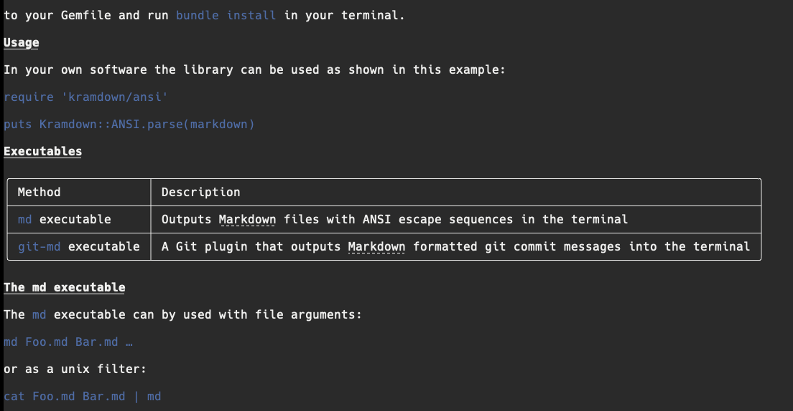
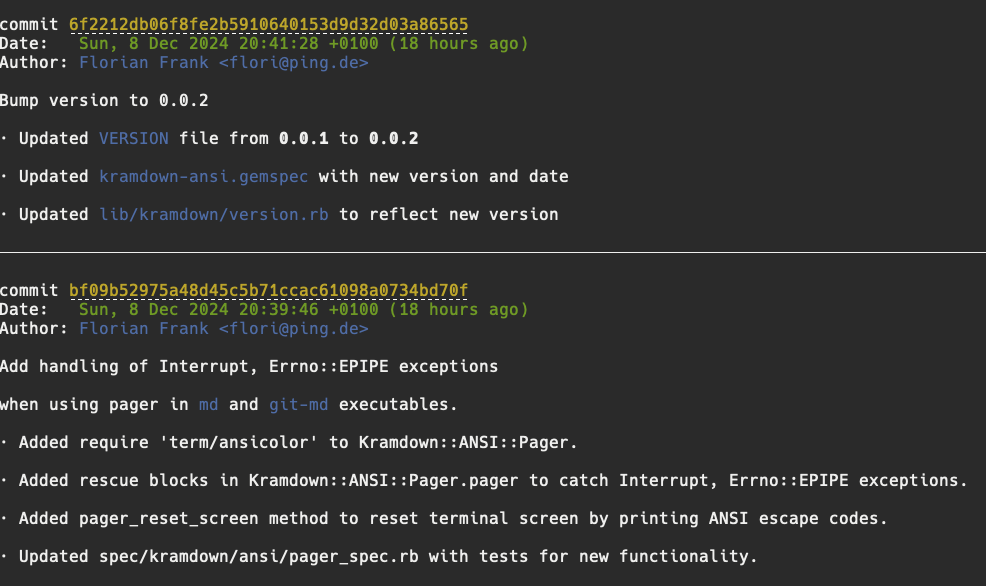

# Kramdown ANSI - Output markdown with ANSI

## Description

**Kramdown::ANSI**: A library for rendering Markdown(ish) documents with beautiful
ANSI escape sequences _in the terminal_.

## Installation (gem &amp; bundler)

To install Kramdown::ANSI, you can use the following methods:

1. Type

```shell
gem install kramdown-ansi
```

in your terminal.

1. Or add the line

```ruby
gem 'kramdown-ansi'
```

to your Gemfile and run `bundle install` in your terminal.

## Usage

In your own software the library can be used as shown in this example:

```ruby
require 'kramdown/ansi'

puts Kramdown::ANSI.parse(markdown)
```

### Custom ANSI Styles

You can customize the ANSI styles by passing an `ansi_styles` option:

```ruby
require 'kramdown/ansi'

ansi_styles = {
  header: [:bold, :magenta],
  strong: :green,
  em:     :yellow,
  code:   [:cyan, :underline]
}

puts Kramdown::ANSI.parse(markdown, ansi_styles:)
```

### Custom ANSI Styles from JSON and JSON env vars

You can configure ANSI styles programmatically from JSON using the built-in
methods:

```ruby
require 'kramdown/ansi'

# Using from_json method
json_config = '{"header": ["bold", "magenta"], "code": ["cyan", "underline"]}'
ansi_styles = Kramdown::ANSI::Styles.from_json(json_config)

# Apply to parsing
puts Kramdown::ANSI.parse(markdown, ansi_styles:)

# Using from_env_var method  
ENV['MY_STYLES'] = '{"em": "yellow", "strong": "green"}'
ansi_styles = Kramdown::ANSI::Styles.from_env_var('MY_STYLES')

# Apply to parsing
puts Kramdown::ANSI.parse(markdown, ansi_styles:)
```

## Executables

| Method | Description | Environment Variables |
| :------- | :---------- | :-------------------- |
| `md` executable | Outputs [Markdown](https://spec.commonmark.org/current/) files with ANSI escape sequences in the terminal | `PAGER`, `KRAMDOWN_ANSI_MD_STYLES`, `KRAMDOWN_ANSI_STYLES` |
| `git-md` executable | A Git plugin that outputs [Markdown](https://spec.commonmark.org/current/) formatted git commit messages into the terminal | `PAGER`, `GIT_PAGER`, `KRAMDOWN_ANSI_GIT_MD_STYLES`, `KRAMDOWN_ANSI_STYLES` |

The `md` executable first checks for `KRAMDOWN_ANSI_MD_STYLES` environment
variable, and if not found, falls back to `KRAMDOWN_ANSI_STYLES`. These
variables can be used to customize ANSI styles for Markdown rendering. The
`git-md` executable follows the same pattern, checking
`KRAMDOWN_ANSI_GIT_MD_STYLES` first, then `KRAMDOWN_ANSI_STYLES`, allowing
customization of ANSI styles for Git commit message formatting.

### The md executable

The `md` executable can by used with file arguments:

```shell
md Foo.md Bar.md …
```

or as a unix filter:

```shell
cat Foo.md Bar.md | md
```

It outputs the markdown files with ANSI escape sequences in the terminal. If
the file has more lines than the current terminal window has, it attempts to
open a pager command like `less` or `more` and pipes its output into it.
By setting the `PAGER` environment variable accordingly one can define a custom
command for this purpose.

The output of the `md` command can be seen in this screenshot:




### Example: Configuring `md` with Specific Environment Variable

```bash
# Using KRAMDOWN_ANSI_MD_STYLES (most specific for md executable)
KRAMDOWN_ANSI_MD_STYLES='{"header": ["bold", "magenta"], "code": ["cyan", "underline"]}' md README.md
```

### The git-md executable

The `git-md` executable is a git plugin that can be used to output markdown
formatted git commit messages (just like `git log`) into the terminal using

```shell
git md
```

You can pass arguments to it like you would of `git log`, e.g.

```shell
git md -p
```

to show the patches additionally to the log messages.

By setting the `GIT_PAGER` or `PAGER` environment variable accordingly one can
define a custom command for this purpose as well, unless a different
pager command was defined setting `git config set core.pager FOO`, in which
case the FOO command is used as a pager for all git commands including `git
md`.

The output of the `git md` command can be seen in this screenshot:



### Example: Configuring `git-md` with Specific Environment Variable

```bash
# Using KRAMDOWN_ANSI_GIT_MD_STYLES (most specific for git-md executable)
KRAMDOWN_ANSI_GIT_MD_STYLES='{"header": ["bold", "blue"], "code": "red"}' git md
```

## Download

The homepage of this library is located at

* https://github.com/flori/kramdown-ansi

## Author

<b>Kramdown ANSI</b> was written by Florian Frank [Florian Frank](mailto:flori@ping.de)

## License

[MIT License](./LICENSE)

## Mandatory Kitten Image


---

This is the end.
